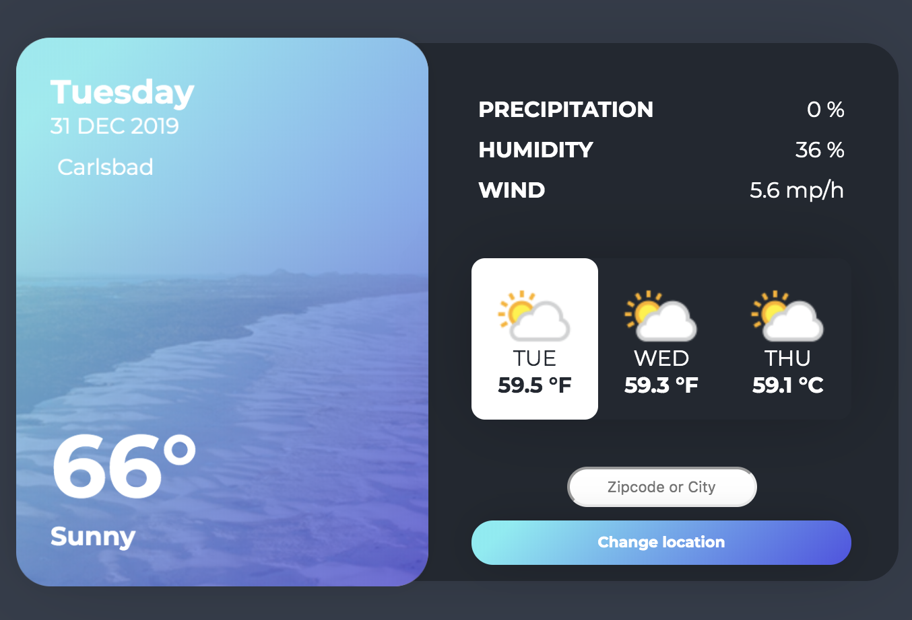

# APIWeather

[Weather API Website](https://weatherapi23.herokuapp.com/ "Weather API Website")

UI Designed by [mmeiers]( https://codepen.io/mmeiers "mmeiers")

 I programmed the backend using JavaScript(NodeJs)/Express/Request 

